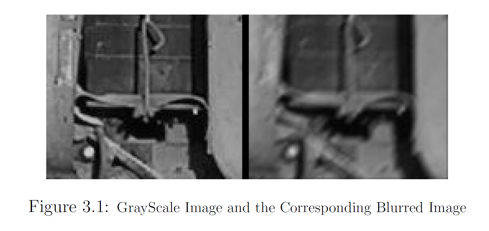

# Image Processing Masks-Convolution

Developing from Scratch Masks that change Images and apply them via Convolution to understand the Basics of Image Processing - Originally developed 04/05/2018

## What was developed in this project
1. A function that produces a Convolution between two images in the **Spatial Domain** 
2. A function that produces a Convolution between two images in the **Frequency Domain**
3. A Convolution of an Image with a Mask 
4. Convolution of a Mask that creates Motion Blur in the Image

## Results of the Project 

## What I learned from this Project
This was a great combination between Maths, Engineering, and Programming. I understood better Convolution and how to use it in the real world.

## Which were the project difficulties 
Mainly combining the theory of masks to the real world, using an actual algorithm that is robust on different images.
## My solutions
Basically, I needed to go back to understand better the theory and then work again on the same problem in order to make a system that can be implemented in the real world. 
