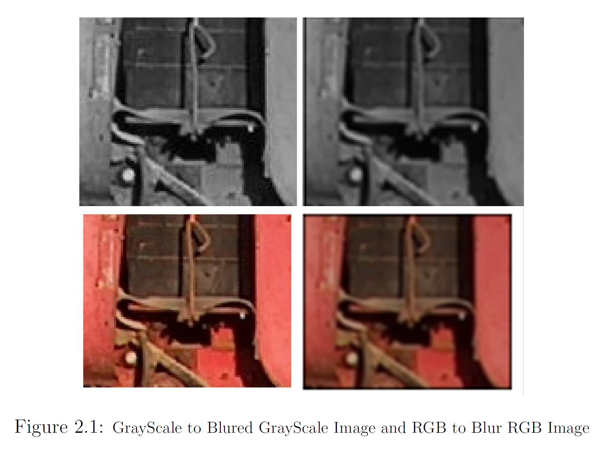

# Image Processing Masks-Convolution

Developing from Scratch Filters that change Images and apply them via Convolution With the purpose to Uderstand the Basics of Image Processing

In this project it was developed 
1. A function that produces a Convolution between two images in the **Spatial Domain** 
2. A function that produces a Convolution between two images in the **Frequency Domain**
3. A Convolution of an Image with a Mask 
4. Convolution of a Mask that creates Motion Bluer in the Image

## Results of the Project 

